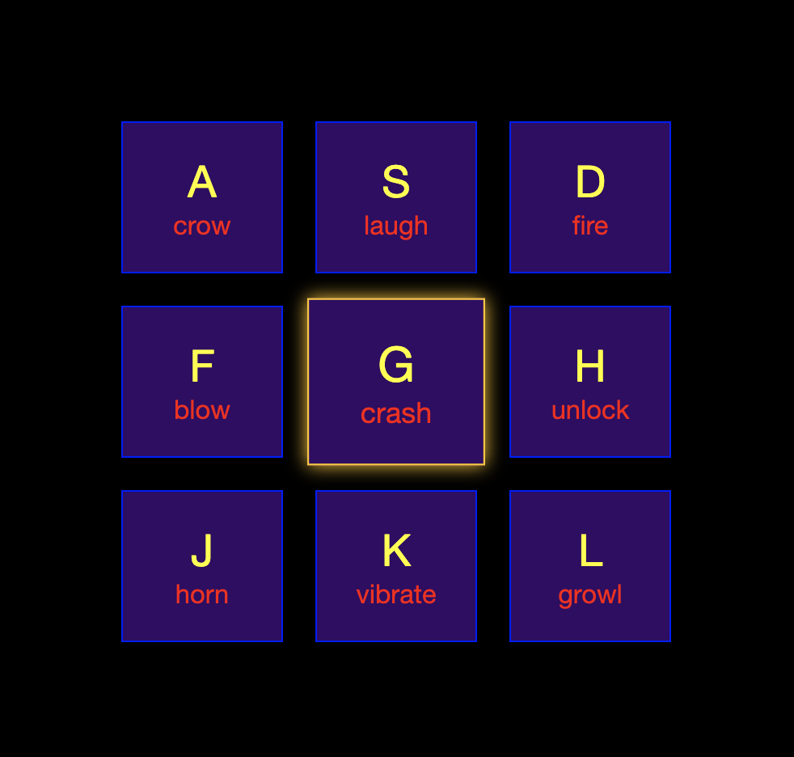

# Drum Kit

Drum Kit made with Vanilla JavaScript, CSS, HTML. Includes working with DOM & Interface.

By pushing a key down [ASDFGHJKL], a sound will appear and its button on screen lightens up. The user can rewind to starting sound of a key by hitting several times. Displayed in flexbox.

Based on a course of https://javascript30.com/ | Sounds taken from https://www.salamisound.de/
