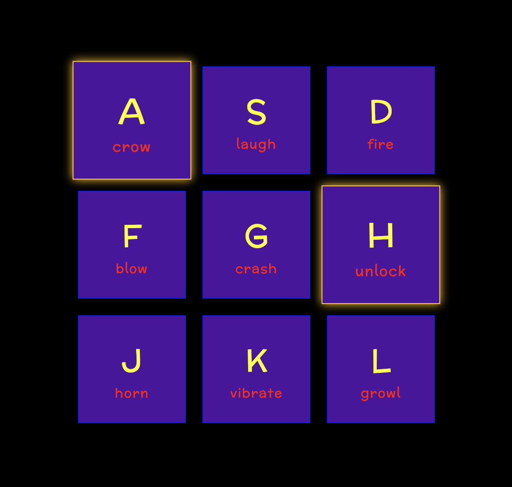

# Drum Kit

TECH STACK:\
HTML, CSS with Flexbox, Vanilla JavaScript with DOM & Interface

DEMO:\
https://isa2008.github.io/drum-kit/

FEATURES:\
By pushing one of the following keyboard's keys: A, S, D, F, G, H, J, K, L, a sound will play and its button on screen lightens up. A tone can be played from the start by hitting its key fastly.

Based on a course of https://javascript30.com/ | Sounds taken from https://www.salamisound.de/
